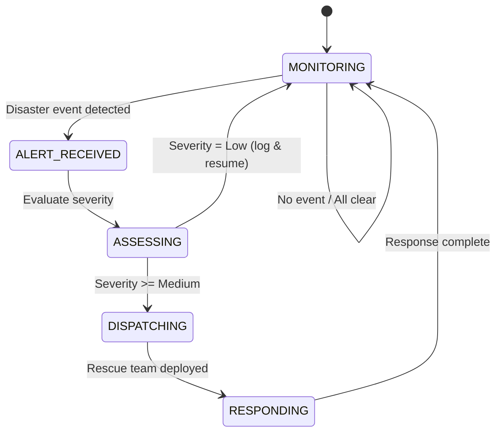

# Lab 3: Rescue Agent FSM Diagram – Reactive Behavior

## States

| State            | Description                                      |
|------------------|--------------------------------------------------|
| MONITORING       | Agent monitors environment for disaster events   |
| ALERT_RECEIVED   | A disaster event has been detected by the sensor |
| ASSESSING        | Agent evaluates severity of the detected event   |
| DISPATCHING      | Agent dispatches rescue resources                |
| RESPONDING       | Agent is actively responding to the disaster     |

## Transitions

| From             | To               | Trigger / Condition                    |
|------------------|------------------|----------------------------------------|
| MONITORING       | ALERT_RECEIVED   | Disaster event detected                |
| MONITORING       | MONITORING       | No event detected (all clear)          |
| ALERT_RECEIVED   | ASSESSING        | Evaluate severity                      |
| ASSESSING        | DISPATCHING      | Severity is Medium, High, or Critical  |
| ASSESSING        | MONITORING       | Severity is Low (log and resume)       |
| DISPATCHING      | RESPONDING       | Rescue team deployed                   |
| RESPONDING       | MONITORING       | Response complete                      |

## FSM Diagram (Mermaid)

